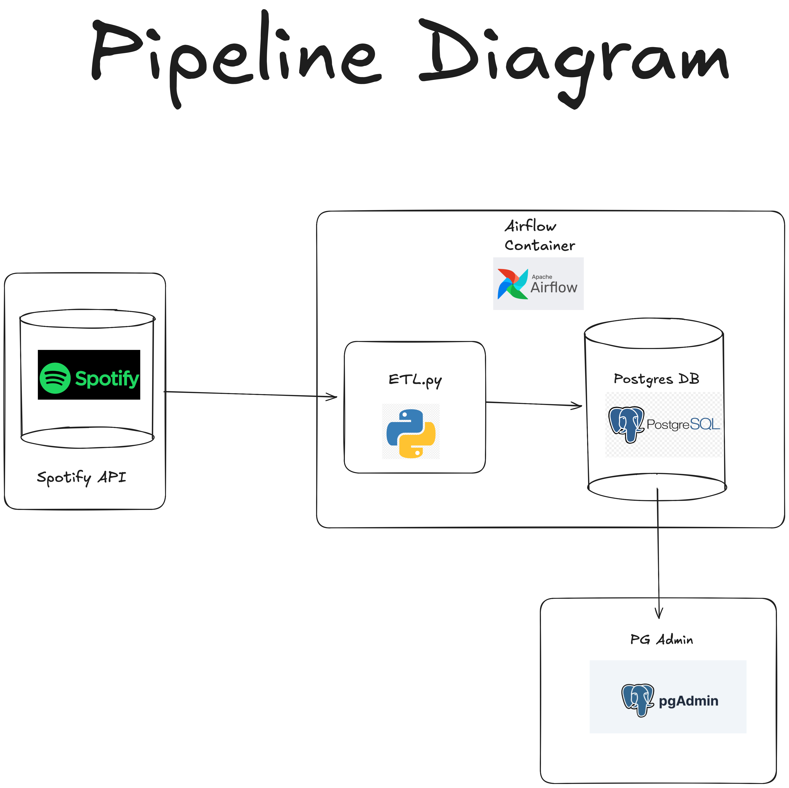
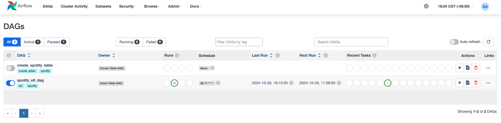

# Spotify ETL with Airflow

## Note
This project configuration, including passwords and documentation, is set up for learning purposes. I am learning how to orchestrate pipelines using Apache Airflow. Many default settings in Airflow should be modified to ensure a secure production environment.

## Project Description

This project implements an ETL (Extract, Transform, Load) pipeline using Apache Airflow to extract data from the Spotify API, transform it, and load it into a PostgreSQL database. The pipeline is containerized using Docker, ensuring a consistent and reproducible environment. The ETL runs at 11:58 PM every day and extracts the music you listened to during the day.

### Pipeline Diagram


### Key Features
- **Data Extraction**: Fetches data from the Spotify API.
- **Data Transformation**: Processes and cleans the extracted data.
- **Data Loading**: Stores the transformed data in a PostgreSQL database.
- **Containerization**: Utilizes Docker to run Airflow and PostgreSQL in isolated containers.
- **Scheduling**: Uses Airflow DAGs to schedule and manage the ETL workflow.

### Technologies Used
- **Apache Airflow**: For orchestrating the ETL pipeline. [Learn more](https://airflow.apache.org)
- **Spotify API**: As the data source. [Learn more](https://developer.spotify.com)
- **PostgreSQL**: For storing the processed data.
- **Docker**: For containerization. [Learn more](https://www.docker.com)

### Setup and Installation
1. **Clone the repository**:
    ```sh
    git clone https://github.com/bkoscar/spotify-etl-airflow.git
    cd spotify-etl-airflow
    ```

2. **Create and configure the `.env` file**:
    ```sh
    # Edit the config/.env file to include your Spotify API credentials and database configuration
    cp .env.example config/.env
    ```

3. **Build and run the Docker containers**:
    ```sh
    echo -e "AIRFLOW_UID=$(id -u)" > .env
    docker-compose up --build
    ```

4. **Create the PostgreSQL database**:
    - Use a database management tool like PgAdmin or DBeaver to connect to the PostgreSQL instance.
    - Create a new database with the name `spotify_etl_db`.
    - Connection details:
        - **Username**: `airflow`
        - **Password**: `airflow`
        - **Database**: `airflow`
        - **Host**: `localhost`
        - **Port**: `5432`

5. **Access the Airflow web interface**:
    - Open your browser and go to `http://localhost:8080`
    - Use the default credentials to log in (username: `airflow`, password: `airflow`)



6. **Trigger the DAG to create the table**:
    - In the Airflow web interface, manually trigger the DAG responsible for creating the table in the PostgreSQL database.

7. **Unpause the DAG to insert data**:
    - Ensure the DAG responsible for inserting data is unpaused to allow it to run according to its schedule.

### Usage
- **Monitor the Pipeline**: Use the Airflow web interface to monitor the status of the tasks and the overall pipeline.
